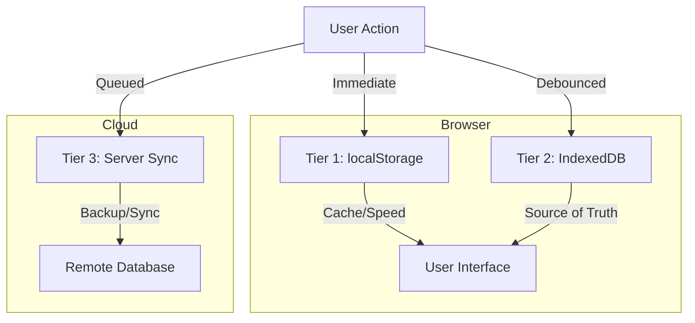

# 🛡️ The RangerPlex 3-Tier Persistence Standard
## A Master Guide to Zero Data Loss Architecture

**Created**: November 24, 2025
**Author**: Colonel Gemini Ranger
**Status**: STANDARD PROTOCOL
**Applicability**: All RangerPlex AI features and future projects

---

## 🎯 The Philosophy: Zero Data Loss

In the RangerPlex ecosystem, user data is sacred. Whether it's a chat message, a canvas drawing, or a user setting, **nothing must ever be lost**.

To achieve this, we do not rely on a single storage method. We use a **3-Tier Persistence Architecture** that provides redundancy, speed, and reliability.

---

## 🏗️ The 3-Tier Architecture



### 🔹 Tier 1: The "Hot Cache" (localStorage)
- **Purpose**: Instant UI feedback and session speed.
- **Behavior**: Synchronous, blocking (must be fast).
- **Limit**: ~5-10MB.
- **Risk**: Cleared when user clears "Cached images and files".
- **Rule**: Use for small, active state only.

### 🔹 Tier 2: The "Vault" (IndexedDB)
- **Purpose**: Long-term, robust browser storage.
- **Behavior**: Asynchronous, transactional.
- **Limit**: ~50MB - 1GB+ (depends on disk space).
- **Benefit**: Survives standard cache clearing.
- **Rule**: The local "Source of Truth". Always load from here on startup.

### 🔹 Tier 3: The "Cloud" (Server Sync)
- **Purpose**: Permanent backup and cross-device synchronization.
- **Behavior**: Asynchronous, queued, retry-able.
- **Benefit**: Disaster recovery.
- **Rule**: Never block the UI for this. Use a background queue.

---

## 🛠️ Implementation Guide: How to Add 3-Tier Memory

Follow this standard procedure when adding any new feature that requires data persistence.

### Phase 1: Infrastructure Setup

#### 1. Define the Schema
Add your new store to `dbService.ts` (IndexedDB wrapper).
```typescript
// services/dbService.ts
const STORES = {
  CHATS: 'chats',
  SETTINGS: 'settings',
  NEW_FEATURE: 'new_feature_items' // <--- Add this
};

// In init():
if (!db.objectStoreNames.contains(STORES.NEW_FEATURE)) {
  db.createObjectStore(STORES.NEW_FEATURE, { keyPath: 'id' });
}
```

#### 2. Create the Service
Create a dedicated service file (e.g., `newFeatureDbService.ts`) for Tier 2 operations.
- Implement `save`, `load`, `delete`, `clear`.
- Always use `async/await`.

#### 3. Update Auto-Save Service
Register your feature with `autoSaveService.ts` to handle Tier 3 syncing.
```typescript
// services/autoSaveService.ts
export const queueNewFeatureSave = (item: any, enableCloud: boolean) => {
  autoSaveService.queueSave(`feature:${item.id}`, async () => {
    // 1. Save to Tier 2 (IndexedDB)
    await newFeatureDbService.save(item);
    
    // 2. Sync to Tier 3 (Cloud)
    if (enableCloud) {
      syncService.send({ type: 'feature_update', data: item });
    }
  });
};
```

---

### Phase 2: The Hook (The Brain)

Create a React hook (e.g., `useNewFeature.ts`) that manages the state and orchestrates the 3 tiers.

#### Pattern:
```typescript
export const useNewFeature = () => {
  const [data, setData] = useState([]);
  const [isHydrated, setIsHydrated] = useState(false);

  // 1. HYDRATION (Load on mount)
  useEffect(() => {
    const load = async () => {
      // Try Tier 2 (IndexedDB) first
      const dbData = await newFeatureDbService.load();
      if (dbData.length > 0) {
        setData(dbData);
      } else {
        // Fallback to Tier 1 (localStorage) if needed/migrating
        const localData = localStorage.getItem('feature_key');
        if (localData) setData(JSON.parse(localData));
      }
      setIsHydrated(true);
    };
    load();
  }, []);

  // 2. PERSISTENCE (Save on change)
  useEffect(() => {
    if (!isHydrated) return;

    // Tier 1: Immediate Save
    localStorage.setItem('feature_key', JSON.stringify(data));

    // Tier 2 & 3: Queued/Debounced Save
    queueNewFeatureSave(data, true);
  }, [data, isHydrated]);

  return { data, setData };
};
```

---

## 📋 The "Zero Loss" Checklist

Before marking a feature as "Complete", verify these 5 scenarios:

1.  ✅ **The Refresh Test**: Reload the page. Data should appear instantly (Tier 1/2).
2.  ✅ **The Cache Clear Test**: Clear browser "Cached images and files". Reload. Data MUST still be there (Tier 2).
3.  ✅ **The Offline Test**: Go offline. Make changes. Reload. Data should persist locally. Go online. Data should sync (Tier 3).
4.  ✅ **The Migration Test**: If upgrading from an old version, does old data automatically move to the new system?
5.  ✅ **The Quota Test**: Can it handle the maximum expected data (e.g., 1000 items or 10 canvas boards)?

---

## 🧩 Reusable Code Snippets

### Migration Helper
Use this to move data from Tier 1 to Tier 2 automatically.
```typescript
async function migrateFromLocalStorage(key: string, dbService: any) {
  const local = localStorage.getItem(key);
  if (local) {
    const data = JSON.parse(local);
    await dbService.save(data);
    console.log('✅ Migrated data to Vault');
    return data;
  }
  return null;
}
```

### Debounce Logic
Prevent freezing the UI with too many saves.
```typescript
// In autoSaveService
private debounceMs = 500;
// ... timer logic resets on every new save request
```

---

## 🚀 Future Proofing

- **Backup/Restore**: (✅ Completed) JSON export/import is now standard via `BackupManager`.
- **System Updates**: (✅ Completed) Users can check for updates via `Settings > Help`.
- **Versioning**: Add a `version` field to your data schemas to handle future structure changes.
- **Compression**: For large data (like Canvas), consider compressing before storing in Tier 2/3.

**Rangers lead the way!** 🦅
